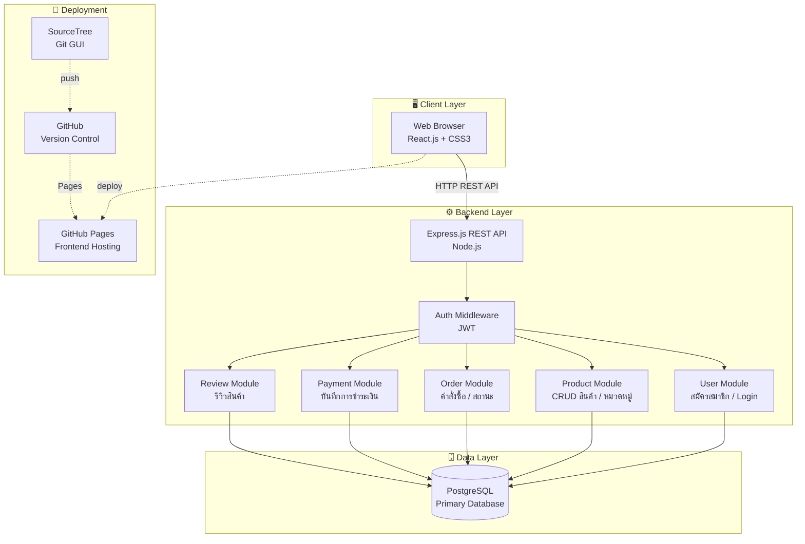

# Analysis & Design Document
## Skincare Shop — ระบบร้านค้าออนไลน์ผลิตภัณฑ์ดูแลผิวพรรณ

วิชา: CSI204 Digital Platform for Software Development  
ประเภท: E-Commerce Web Platform  
Architecture: Monolithic (3-Layer Architecture)

---

## 1. ภาพรวมระบบ (System Overview)

ระบบร้านค้าออนไลน์สำหรับจำหน่ายผลิตภัณฑ์ Skincare ครบวงจร ประกอบด้วย 2 ส่วนหลัก ได้แก่ ฝั่งผู้ใช้งาน (User Frontend) สำหรับค้นหาและสั่งซื้อสินค้า และ ฝั่งผู้ดูแลระบบ (Admin Dashboard) สำหรับจัดการสินค้าและคำสั่งซื้อ

---

## 2. ผู้ใช้งานระบบ (Stakeholders)

| ประเภทผู้ใช้ | บทบาท |
|-------------|--------|
| **Guest** | เข้าชมสินค้า ค้นหาสินค้า แต่ยังไม่สามารถสั่งซื้อได้ |
| **Member (ลูกค้า)** | สมัครสมาชิก สั่งซื้อสินค้า ติดตามคำสั่งซื้อ |
| **Admin** | จัดการสินค้า จัดการคำสั่งซื้อ ดู Dashboard รายงาน |

---

## 3. ความต้องการของระบบ (System Requirements)

### 3.1 ฝั่งผู้ใช้งาน (User Side)

#### 🔐 ระบบสมาชิก (Authentication)
- สมัครสมาชิกด้วย Email และ Password
- เข้าสู่ระบบ / ออกจากระบบ
- แก้ไขข้อมูลส่วนตัว (ชื่อ, ที่อยู่, เบอร์โทร)
- รีเซ็ตรหัสผ่านผ่าน Email

#### 🛒 ระบบสินค้า (Product)
- แสดงรายการสินค้าทั้งหมดพร้อมรูปภาพและราคา
- กรองสินค้าตามหมวดหมู่ (เช่น Cleanser, Moisturizer, Serum, Sunscreen)
- ค้นหาสินค้าด้วยชื่อหรือคำค้นหา
- ดูรายละเอียดสินค้า (ส่วนผสม, วิธีใช้, ขนาด)

#### 🛍️ ตะกร้าสินค้า (Cart)
- เพิ่ม / ลบ / แก้ไขจำนวนสินค้าในตะกร้า
- แสดงราคารวมแบบ Real-time
- บันทึกตะกร้าสินค้าไว้สำหรับครั้งต่อไป

#### 💳 ระบบคำสั่งซื้อ (Order)
- กรอกที่อยู่จัดส่ง
- ยืนยันคำสั่งซื้อ
- ดูประวัติคำสั่งซื้อและสถานะการจัดส่ง

#### 💰 ระบบชำระเงิน (Payment)
- เลือกวิธีการชำระเงิน
- บันทึก Transaction และสถานะการชำระเงิน
- เชื่อมโยงการชำระเงินกับคำสั่งซื้อ

#### ⭐ ระบบรีวิวสินค้า (Review)
- ให้คะแนนสินค้า 1–5 ดาว หลังซื้อสินค้า
- แสดงความคิดเห็นและรีวิวจากผู้ซื้อ

---

### 3.2 ฝั่งผู้ดูแลระบบ (Admin Side)

#### 📊 Dashboard
- แสดงยอดขายรายวัน / รายเดือน
- จำนวนคำสั่งซื้อใหม่ที่รอดำเนินการ
- สินค้าขายดี Top 5
- จำนวนสมาชิกทั้งหมด

#### 📦 จัดการสินค้า (Product Management)
- เพิ่ม / แก้ไข / ลบสินค้า
- จัดการหมวดหมู่สินค้า
- ตั้งราคาและจำนวนสต็อก
- ซ่อน / แสดงสินค้า

#### 🧾 จัดการคำสั่งซื้อ (Order Management)
- ดูรายการคำสั่งซื้อทั้งหมด
- เปลี่ยนสถานะคำสั่งซื้อ (รอชำระ → ชำระแล้ว → จัดส่งแล้ว → สำเร็จ)
- ยกเลิกคำสั่งซื้อ

#### 👥 จัดการสมาชิก (User Management)
- ดูรายชื่อสมาชิกทั้งหมด
- ระงับ / ปลดระงับบัญชีผู้ใช้
- ดูประวัติการสั่งซื้อของแต่ละสมาชิก

---

## 4. สถาปัตยกรรมระบบ (System Architecture)

ระบบใช้ **3-Layer Architecture** แบ่งออกเป็น Frontend, Backend และ Database โดยมีการสื่อสารผ่าน REST API

### 4.1 Frontend Architecture
- **React.js** — Component-Based, Single Page Application (SPA)
- **CSS3** — Styling
- แบ่งหน้าตาม Route: `/`, `/products`, `/cart`, `/checkout`, `/admin`
- ใช้ JWT Token เก็บใน localStorage สำหรับ Authentication

### 4.2 Backend Architecture
- **Node.js + Express.js** — REST API Server
- ใช้ **JWT** สำหรับ Authentication และ Authorization
- แบ่ง Module ตาม Separation of Concerns:
  - `User Module` — สมัครสมาชิก, Login, JWT
  - `Product Module` — CRUD สินค้า, หมวดหมู่
  - `Order Module` — สร้างคำสั่งซื้อ, สถานะ
  - `Payment Module` — บันทึกการชำระเงิน, Transaction
  - `Review Module` — รีวิวและให้คะแนนสินค้า

### 4.3 Database Architecture
- **PostgreSQL** — Relational Database
- ตารางหลัก: `users`, `products`, `categories`, `orders`, `order_items`, `payments`, `reviews`

---

## 5. System Architecture Diagram

---

## 6. Database Design

### ตารางหลัก (Main Tables)

| ตาราง | คำอธิบาย | คอลัมน์สำคัญ |
|-------|----------|--------------| 
| `users` | ข้อมูลผู้ใช้งานและการยืนยันตัวตน | id, name, email, password, role |
| `products` | ข้อมูลสินค้า ราคา สต็อก | id, name, price, stock, category_id |
| `categories` | หมวดหมู่สินค้า (เซรั่ม, ครีมกันแดด ฯลฯ) | id, name |
| `orders` | คำสั่งซื้อและสถานะ | id, user_id, total, status |
| `order_items` | รายการสินค้าในแต่ละคำสั่งซื้อ | id, order_id, product_id, qty, price |
| `payments` | ข้อมูลการชำระเงินและ transaction | id, order_id, method, status, paid_at |
| `reviews` | รีวิวและคะแนนสินค้าจากผู้ซื้อ | id, user_id, product_id, rating, comment |

## 7. Security Design

- **Authentication** — JWT (JSON Web Token) หมดอายุใน 24 ชั่วโมง
- **Authorization** — แยก Role: `member` และ `admin`
- **Password** — เข้ารหัสด้วย bcrypt
- **HTTPS** — บังคับใช้ใน Production
- **Input Validation** — ตรวจสอบข้อมูลก่อน Query ทุกครั้ง

---

## 8. Software Architecture Principles ที่ใช้

| หลักการ | การนำไปใช้ในโปรเจกต์นี้ |
|---------|------------------------|
| **Separation of Concerns** | แยก Frontend / Backend / Database ออกจากกันชัดเจน |
| **Single Responsibility** | แต่ละ Module รับผิดชอบเพียงหน้าที่เดียว เช่น `OrderModule` ดูแลเฉพาะคำสั่งซื้อ |
| **Modularity** | แบ่ง Backend เป็น User, Product, Order, Payment, Review Module |
| **Loose Coupling** | Frontend และ Backend สื่อสารผ่าน REST API เท่านั้น |
| **Security by Design** | JWT Authentication + bcrypt + Input Validation ทุกจุด |